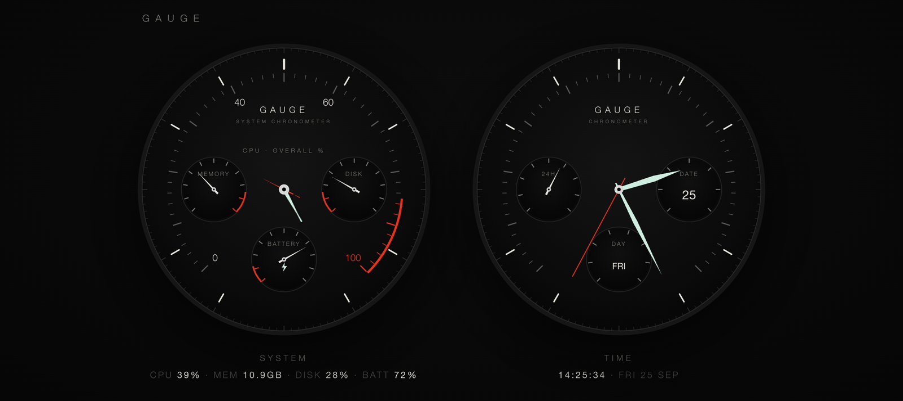
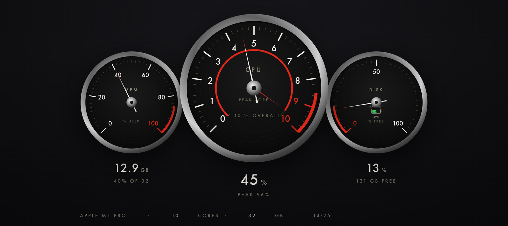
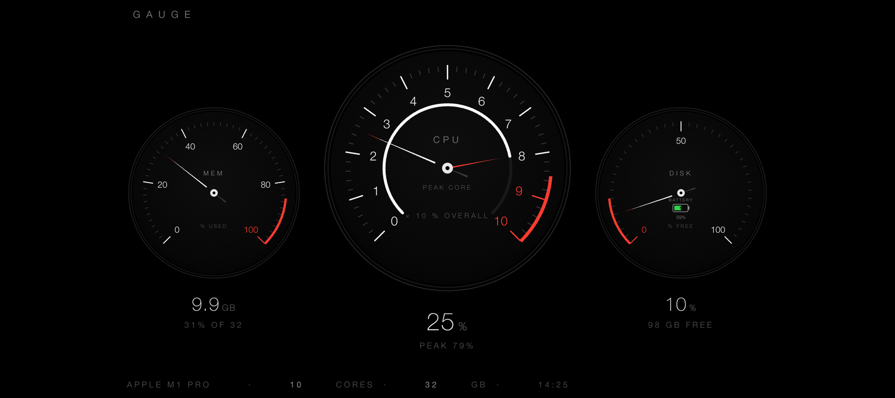
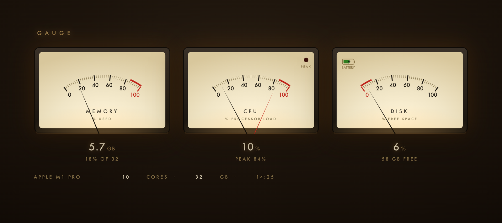

# Gauge

<p align="center">
  
</p>

<p align="center">
  
  
  
</p>
<p align="center"><sub>Watch + Clock (top) · Vintage · Clean · VU Meters, all running on real system data</sub></p>

A minimal, beautiful macOS system monitor — CPU, memory, and disk shown as
vintage-instrument dials. Inspired by Porsche gauge clusters and classic
analog meters.

> **Built for a second screen.** Gauge can run locally in a window on your Mac,
> but it's designed to live on a **dedicated, network-attached display** — an
> old iPad, a Raspberry Pi with a small screen, a spare phone, or anything else
> with a web browser. Your Mac serves the dials over your local network; the
> other device just shows them, always on, like an instrument cluster beside
> your desk. See [Always-on display](#always-on-display-ipad-raspberry-pi-phone-any-browser).

## The app

The stat engine is a self-contained, dependency-free macOS system monitor: per-core
CPU is read from the mach kernel via `ctypes`, memory from `vm_stat`, disk from `os`,
battery from `pmset`. It serves a tiny local web UI over stdlib `http.server`.

**`Gauge.app` launches a chooser.** Double-clicking it ensures the local server
is running, then opens a chrome-less Chrome window with a **chooser** that lets
you pick one of four live displays:

| Choice | Route | Look |
|--------|-------|------|
| **Vintage** | `/vintage` | Porsche 997 chrome three-dial cluster |
| **Clean** | `/minimal` | Minimal white-on-black three-dial |
| **Watch + Clock** | `/pair` | System chronograph + a real-time clock |
| **VU Meters** | `/vu` | Warm analog VU meters |

All four views are driven live from `/stats` and share one render engine
(`web/core.js`); the thin per-view shells live in `web/`. `gauge.py` remains
runnable directly for just the minimal windowed dashboard (auto-quits a few
seconds after its window closes).

### Two forms

- **`Gauge.app`** — the chooser + the four chrome-less dashboards above.
  Pure stdlib; runs on the system `/usr/bin/python3`.
- **`GaugeBar.app`** — a native **menu-bar** app (`NSStatusBar`). The menu bar
  shows live CPU; the dropdown breaks out CPU (overall + peak core), memory,
  disk, and battery, plus **Open Dashboard** and **Quit**. Requires PyObjC
  (`import AppKit`) — bundled with the python.org framework Python; if missing,
  `pip3 install pyobjc`.

### Install / run

```sh
./install.sh               # build both apps and copy them to /Applications
python3 gauge.py           # or just run the dashboard directly
```

`build_app.sh` / `build_bar.sh` package each `.app` (launcher + scripts + icon)
for Finder. `create_icon.py` regenerates `Gauge.icns` (needs Pillow; the
committed `.icns` means you usually don't need to).

**Menu-bar difference for a Safari build:** the dashboard opens its UI in
Chrome's app mode (a chrome-less window). Safari has no chrome-less mode from
the CLI, so a Safari build would show the UI in a normal Safari window with the
full address bar/toolbar — functional, but it reads as a web page, not an app.
A truly native window would use a WebView (PyObjC), trading the zero-Chrome
requirement for the PyObjC dependency.

## Always-on display (iPad, Raspberry Pi, phone, any browser)

`gauge_server.py` is a persistent, LAN-reachable server that serves the same
**chooser** and all four live views (`/`, `/minimal`, `/vintage`, `/vu`,
`/pair`) plus the `/stats` JSON feed — point an old iPad or phone at it and pick
a display, then leave it on as a dedicated screen. The VU view's CPU uses a dual
reading (black needle = overall load, red needle = peak core) plus a PEAK lamp;
the disk meter carries the battery indicator. It binds `0.0.0.0` on a fixed port
(default 8770), never auto-quits, and uses compatibility-friendly pages (XHR,
SVG-attribute needles) that work back to iOS 10 (iPad mini 2+).

```sh
./install_server.sh        # runs it as a LaunchAgent (starts at login, auto-restarts)
# or just: python3 gauge_server.py
```

Then on the iPad, in Safari, open `http://<mac-ip>:8770/` and **Add to Home
Screen** for a chrome-less full-screen view. Set **Auto-Lock → Never** and keep
it on a charger. Requires the Mac to be on and running the server; both devices
on the same Wi-Fi. Stop with `launchctl bootout gui/$(id -u)/com.jaredblack.gaugeserver`.

On a **Raspberry Pi** (or any small Linux box with a screen), open the same URL
in Chromium's kiosk mode for a borderless full-screen dashboard:

```sh
chromium-browser --kiosk --noerrdialogs http://<mac-ip>:8770/vu
```

Note that the server has no login: anyone on your local network can view your
Mac's system stats at that address. Run it only on a network you trust.

## Desktop widget (Übersicht)

`ubersicht/gauge.widget/` is a live desktop widget — the same dials, pinned to
your desktop, updating every second with CSS-eased needles. It adds a live
**network throughput** row (↓/↑ current rate, read from interface byte-counter
deltas — this is *current activity*, not a speed test).

```sh
brew install --cask ubersicht     # one-time, if not already installed
./install_widget.sh               # copies the widget in and launches Übersicht
```

The widget's `gauge_stats.py` is a self-contained one-shot JSON emitter (same
stdlib approach as the app). Drag the widget to reposition; Übersicht remembers.

## Design mockups

The `gauge_*_*.html` files are **self-contained design mockups** (no build step
— just open in a browser). Each animates with plausible demo data plus a few
real values so the look can be judged. Minimal (A) is the chosen direction and
is what the live app implements.

## What each gauge shows

- **CPU** — a dual-reading tachometer: the long needle is overall load across
  all cores, while an inner ring + short red needle tracks the single hottest
  core (so a spike on one core is visible without the whole gauge jumping).
- **Memory** — memory pressure / used GB of 32 GB.
- **Disk** — free space remaining (redlines when low). A small real-battery
  indicator (charge level + charging bolt) lives inside this dial.

## Mockups

| File | Direction |
|------|-----------|
| `gauge_A_minimal.html` | **Primary.** Pure white on true black, thin bezels, modern-minimal (Braun/Nomos-clean). |
| `gauge_B_997.html` | Porsche 911 (997) instrument cluster — brushed chrome rings, guilloché faces, Futura numerals. |
| `gauge_C_chrono.html` | Porsche Design chronograph — one blacked-out watch dial with tri-compax sub-registers. |
| `gauge_D_retro_green.html` | Retro chrome bezels + phosphor-green glowing dials (vintage lab/oscilloscope). |
| `gauge_E_vu.html` | Warm-backlit analog VU meters with a red PEAK lamp. |

Target machine for the real values shown: **Apple M1 Pro, 10 cores (8P/2E),
32 GB RAM**.

## Roadmap

- [x] Wire the primary design to **live system data** (pure Python stdlib).
- [x] Package as a double-clickable `.app` that launches from Finder.
- [x] Install to `/Applications`; add a native menu-bar app (`GaugeBar.app`).
- [x] Always-on LAN server for an old iPad; VU-meter display.
- [x] **Chooser** launcher — pick 1 of 4 live views (vintage / clean / watch+clock / VU).
- [ ] Optional: code-sign / notarize; launch-at-login; menu-bar mini-graphs.

See `PLAN.md` for the concept + tools tried, and `PROJECT_LOG.md` for the build history.
